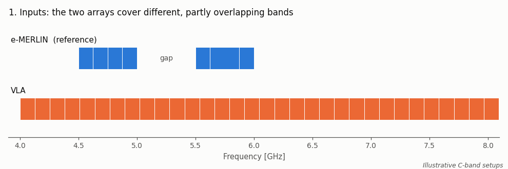
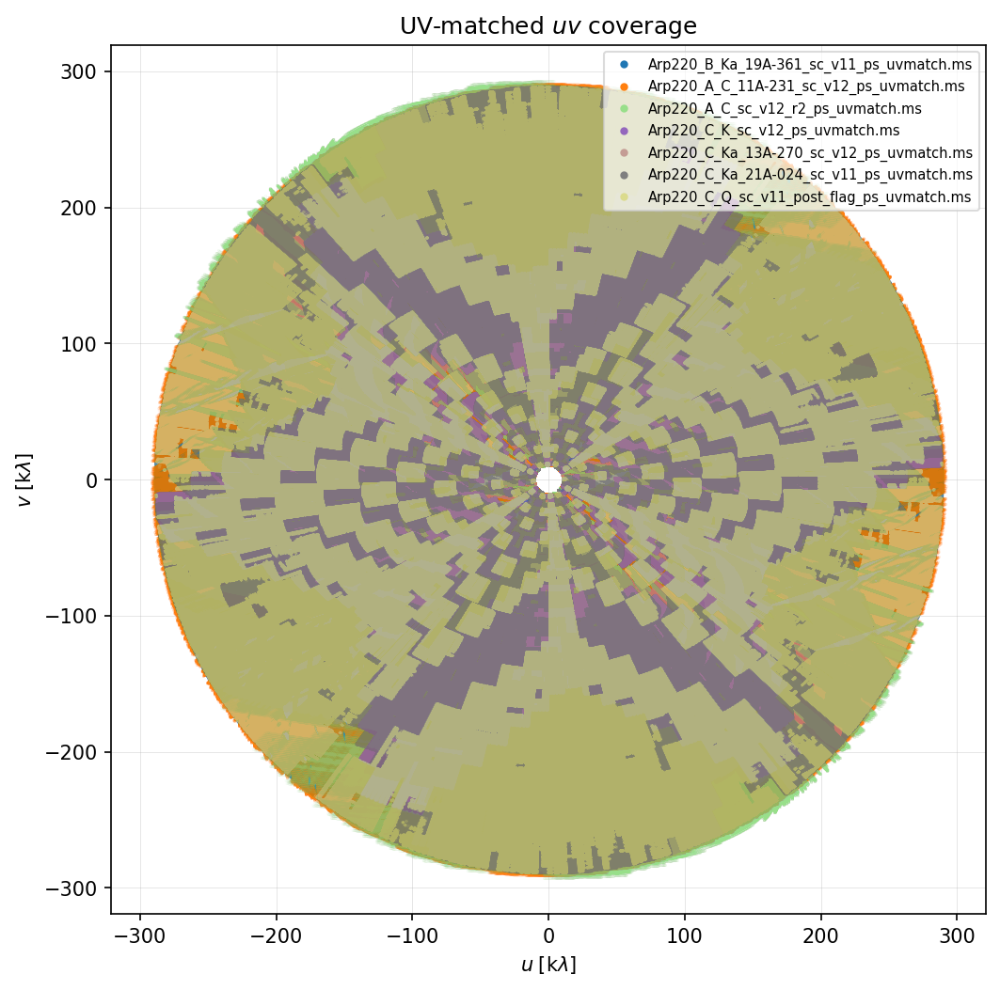
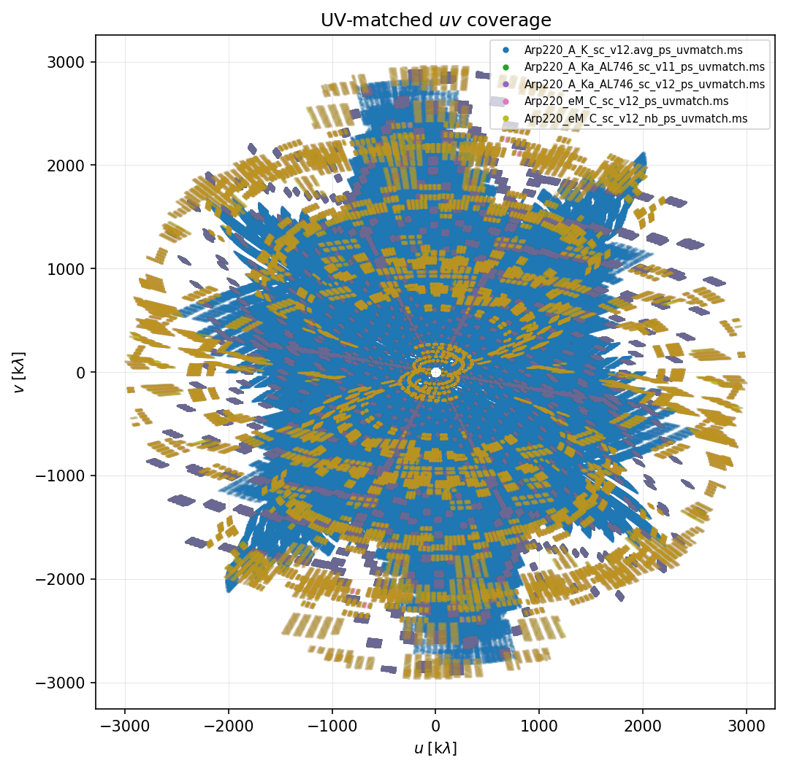
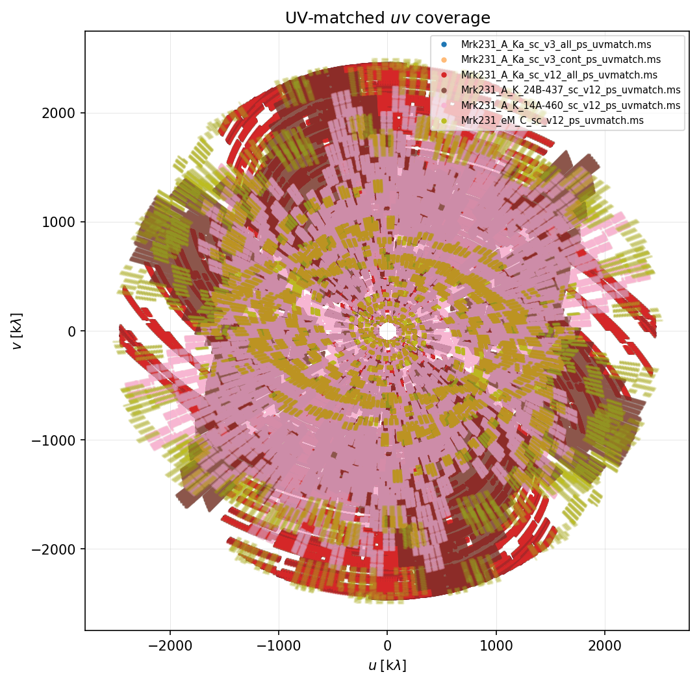

# priysm

A collection of Python/casacore utilities for radio interferometric visibility operations.

## About

`priysm` grew out of the extension modules of the [`ph4ser`](https://github.com/) self-calibration pipeline, where common visibility-handling routines had started to accumulate. Since these tools are useful independently of `ph4ser` - often for manual, case-specific work on measurement sets - they are gathered here as a standalone repository.

To use this repository, you need to create an environment. Please, follow the instruction in the `morphen` repository [`morphen`](https://github.com/lucatelli/morphen).

The two main components are:

- **`concat_vis`** - prepares several measurement sets (MSs) of the same target and concatenates them into one, either for a single instrument (several epochs or array configurations) or across instruments (e.g. e-MERLIN + VLA).
- **`vis_imaging`** - phase-shifts MSs to a common centre, restricts them to a common uv range and images them with WSClean, both at native resolution and with a forced common restoring beam for multi-frequency comparison.

## Repository layout

```text
examples/
  figures/                     # documentation figures and the scripts that make them
priysm/
  concat/
    concat_vis.py              # concatenation pipeline
    concat_vis_cfg.yaml        # its default config
  uv_match_and_imaging/
    vis_imaging.py             # phaseshift + uv-match + imaging pipeline
    vis_imaging.cfg.yaml       # its default config
  plotting/
    plot_vis_python.py         # diagnostic plots of a single MS; also used by both pipelines
    plot_vis_python_multi.py   # the same plots for several MSs on shared axes
  wsclean_imaging/
    imaging_with_wsclean.py    # standalone WSClean driver
    wsclean_container.py       # finds or downloads the WSClean container image
    channel_division.py        # sub-band division and weight balancing for -channels-out
  additional_modules/
    fix_ms_intents.py          # edit scan intents (STATE/OBS_MODE) in place
    fix_ms_structure.py        # merge ObsIDs, renumber scans, reindex
  previous_versions/           # older copies (concat_pipeline.*, vis_pipeline.*)
  todos_and_improvements/      # development notes
```

`concat_vis.py` and `vis_imaging.py` were previously called `concat_pipeline.py` and `vis_pipeline.py`. The old versions are kept in `previous_versions/`.

## Requirements

- Python 3 with `numpy`, `matplotlib`, `astropy` and `pyyaml`
- Modular CASA: `casatools` and `casatasks` (`vis_imaging` also imports `casaplotms`)
- For imaging: WSClean, run from a Singularity/Apptainer container, and [`morphen`](https://github.com/) (`vis_imaging` calls `mlibs.run_wsclean`; pass its location with `--mlibs-path`)

## Common behaviour of the two pipelines

- **Opt-in stages.** Each stage is enabled with its own `--do-*` switch. The pipeline keeps a list of "active" MSs, and every stage that runs replaces it with its outputs, so later stages always work on the most-processed data.
- **Configuration.** Settings come from, in increasing priority: the built-in defaults, a YAML config and the command line. Use `--config file.yaml`; without it, the default config file (`concat_vis_cfg.yaml` or `vis_imaging.cfg.yaml`) is loaded from the **current working directory** if it exists. YAML keys are the option names with underscores (`--do-phaseshift` becomes `do_phaseshift`). The shipped YAML files differ from the built-in defaults in several places, so when you run next to them, the YAML values are the effective defaults.
- **Boolean options in the YAML.** Setting an option to `true` in the YAML turns it on. It can then only be turned off from the command line if a `--no-*` flag exists (for example `--no-timeavg`); otherwise edit the YAML.
- **Existing outputs are reused.** An output MS that already exists is skipped, not rebuilt. Pass `--force-overwrite` after changing a parameter such as `--timebin`, or the old intermediates are used.

## `concat_vis`: concatenation pipeline

Location: `priysm/concat/concat_vis.py`. Full documentation: [`priysm/concat/README.md`](priysm/concat/README.md).

### Modes

`concat_vis` has two modes, chosen with `--mode`. They differ in how the frequency coverage of the inputs is handled.

#### Single instrument: `--mode same`

Use this mode for several observations of the same target with the **same array**: multiple epochs, different configurations (e.g. VLA A + C) or adjacent sub-bands. Each MS keeps its full bandwidth; frequencies are not matched. As a safety check, the run stops if an MS overlaps the first `--vis` input by less than `--band-guard-factor` (default 0.5) of its bandwidth, which catches mixing of different bands by mistake. Use `--force-concat` to skip this check when the inputs really are different parts of one receiver band, e.g. C-low (4–6 GHz) and C-high (6–8 GHz).

Example: three VLA A-configuration C-band epochs of one target.

```bash
python concat_vis.py \
  --vis M82_A_C_epoch1.ms M82_A_C_epoch2.ms M82_A_C_epoch3.ms \
  --mode same --source-name M82 \
  --do-inspect --do-split --do-phaseshift --do-statwt --do-concat --do-wtspectrum \
  --temp-dir /fast/tmp --output-dir ./concat_epochs
```

`--do-statwt` puts the epochs on a common weight scale, so an epoch with higher sensitivity does not dominate only because of how its weights were computed.

> **Variable sources.** Concatenation assumes the sky is the same in every epoch. If the target varies between epochs (an AGN core, a flare, a transient, or a slowly evolving component), the combined image shows an average brightness, and the mismatch leaves residual sidelobes and artefacts around the variable component that cleaning cannot remove. Self-calibrating the combined data can spread those errors to the rest of the field. Before concatenating, image each epoch separately and compare the flux of compact components. If they differ beyond the calibration uncertainty, either image the epochs separately, or model and subtract the variable component from each epoch before combining. The same applies when combining different arrays observed on different dates (`--mode cross`).

#### Different arrays: `--mode cross`

Use this mode to combine observations from **different arrays whose frequency coverage only partly overlaps**, such as e-MERLIN and the VLA. At C band, e-MERLIN observes a lower and an upper sub-band with a gap between them (about 1 GHz in total), while the VLA covers 4–8 GHz continuously. Concatenating them as they are would give an MS in which e-MERLIN's long baselines exist only in part of the band: the uv coverage, and therefore the resolution and PSF, would change sharply with frequency, which biases multi-frequency imaging and spectral fits.

With `--do-freq-match`, every MS other than the reference is cut to the reference's frequency coverage, channel by channel. A channel is kept when it falls inside any reference SPW widened by `--freq-padding-mhz` on each side; gaps between reference SPWs stay gaps (such as the gap between the e-MERLIN sub-bands), and SPWs with no overlap are dropped. The reference MS is not changed. The result is an MS in which both arrays cover the same frequencies, which is what imaging the combined data needs.



*Illustrative C-band setups. Static version: [`examples/figures/freq_match.png`](examples/figures/freq_match.png); it is made by [`make_freq_match_figure.py`](examples/figures/make_freq_match_figure.py).*

Choosing the reference and the padding:

- **The narrower band must be the reference.** The reference is `--ref-vis`, or the first `--vis` if that is not given. Put the e-MERLIN MS first (or pass it as `--ref-vis`). If the VLA MS were the reference, nothing would be trimmed, because the e-MERLIN band already lies inside the VLA band.
- **Set `--freq-padding-mhz` deliberately.** It is 50 MHz in the shipped `concat_vis_cfg.yaml` but 500 MHz in the script itself. With 500 MHz and the setup in the figure, the VLA data would be kept from 4.0 to 6.5 GHz, including the gap between the e-MERLIN sub-bands.
- Without `--do-freq-match`, cross mode only prints a warning and concatenates the full bands.

Example: e-MERLIN + VLA A configuration at C band, with time and channel averaging.

```bash
python concat_vis.py \
  --vis Arp299_eM_C_2x.wts.ms Arp299_A_C_19A-076_sc_v10.ms \
  --mode cross --source-name Arp299 \
  --do-split --do-timeavg --timebin 6s --do-chanavg --chan-out 64 \
  --do-phaseshift --do-freq-match --freq-padding-mhz 50 \
  --do-statwt --do-concat \
  --temp-dir /fast/tmp --output-dir ./concat_v3
```

### Concatenation stages

| # | Switch | What it does | Output |
| --- | --- | --- | --- |
| 0 | `--do-inspect` | Logs the SPW table and uv statistics (kλ) of each input | log only |
| 1 | `--do-split` | Keeps only the SPWs that were actually observed and the chosen correlations (`--correlation`, default `RR,LL`). Time-averages to `--timebin` when `--do-timeavg` is set | `*_split.ms` |
| 2 | `--do-chanavg` | Channel-averages to about `--chan-out` channels per SPW and creates WEIGHT_SPECTRUM | `*_chanavg.ms` |
| 3 | `--do-phaseshift` | Shifts every MS except the reference to the reference phase centre (`--ref-vis`, or `--ref-phasecentre`) | `*_pshift.ms` |
| 4 | `--do-freq-match` | Keeps only the channels that overlap the reference SPWs (padded by `--freq-padding-mhz`) | `*_freqmatch.ms` |
| 5 | `--do-statwt` | Runs `statwt` and derives one weight scale factor per MS so that all MSs contribute equally. By default it is a preview, and the weights in the MSs are not changed | scale factors |
| 6 | `--do-concat` | Repairs damaged POINTING subtables, then runs CASA `concat` with the scale factors | `<source>_<band>_<N>x_concat.ms` |
| 7 | `--do-wtspectrum` | Adds a WEIGHT_SPECTRUM column to the concatenated MS | `<stem>_concat_wts.ms` |
| - | `--plot-uv` | Overlays the uv coverage of the MSs that went into `concat`, one colour per MS | `<stem>_uv_coverage_total.png` |

Some POINTING subtables, typically left behind by an earlier `concat`, list rows that cannot be read, and `concat` then fails. Before Stage 6 the pipeline replaces such a table with an empty one of the same layout and saves the original in `<output_dir>/damaged_subtables/`. `--no-repair-pointing` turns this off.

### Inputs and outputs

- **Reference MS:** `--ref-vis`, which must be one of the `--vis` inputs. Default: the first `--vis`.
- **Source name:** `--source-name`. Default: the first field name of the reference MS.
- **Band label:** derived from the mean frequency of the reference MS.
- **Directories:** intermediates go to `--temp-dir` and final products to `--output-dir`. Both default to the directory of the first input.
- **Clean-up:** intermediates are deleted at the end unless `--keep-intermediates` is set. The original inputs and the concatenated MS are never deleted.
- **Log:** printed to the terminal only; no log file is written.

### Concatenation pitfalls

- Stage 2 changes the weights of the MS it receives. If Stage 1 is skipped, that is your original MS, and an existing WEIGHT_SPECTRUM column is removed. Run Stage 2 only together with Stage 1.
- With `--ref-phasecentre`, the reference MS itself is not shifted.
- `--plot-uv` currently fails at the end of a run without `--do-concat`.
- The `statwt` result is cached in `<ms>.statwt_cache`. Use `--force-overwrite` when you rebuild intermediates with different settings.
- For linear feeds, pass `--correlation XX,YY`.
- Only single-field MSs are supported: the phase centre and source name are read from the first field.

## `vis_imaging`: phaseshift, uv-match and imaging pipeline

Location: `priysm/uv_match_and_imaging/vis_imaging.py`

Takes MSs of one target, possibly from several instruments and bands, and produces:

1. native-resolution images of each MS;
2. images restricted to a common uv range and restored with a common circular beam, suitable for multi-frequency work such as spectral-index maps or SED decomposition.

### Imaging stages

| # | Switch | What it does | Output |
| --- | --- | --- | --- |
| 1 | `--do-phaseshift` | Shifts **all** MSs, the reference included, to the phase centre of `--ref-vis` or to `--ref-phasecentre` (`--ref-vis` wins if both are given) | `native/<name>_ps.ms` |
| 2 | `--do-uv-match` | Finds the uv range common to all MSs (largest uvmin to smallest uvmax, in kλ) and splits each MS to it. Logs the fraction of rows kept. `--plot-vis` saves an overlay of the matched uv coverage | `uv_matched/<group>/<name>_uvmatch.ms` |
| 3 | `--do-native-imaging` | Images each MS at every `--robust` value. The cell size is fixed (`--cell 0.04arcsec`), the smallest over all MSs (`min`), or computed per MS. `--native-beam-size` and `--native-uvtaper` apply to this stage only | images in `native/` |
| 4 | `--do-uv-matched-imaging` | Images the uv-matched MSs with a common circular beam, in up to three passes (see below) | images in `uv_matched/<group>/` |

Stage 4 works as follows:

1. **Probe:** each MS is imaged at `robust_probe` and its restoring beam is recorded. This pass is skipped when `--matched-beam-size` is given.
2. **Matched imaging:** for each statistic in `--beam-stat` (`mean`, `median`, `min` or `max` of the probe beams), all MSs are imaged with that circular beam at every `--robust` value. Two optional extra groups use other weightings: bands listed in `--bands-plus` are imaged at `--robust-plus`, and bands listed in `--bands-minus` at `--robust-minus`.
3. **Sky taper (optional, `--apply-sky-taper`):** the `--bands-plus` group is imaged again with a uv taper equal to the largest probe beam.

### uv-matched coverage plots

With `--plot-vis`, Stage 2 saves `uv_matched/<group>/uvmatched_uv_coverage.png`, which overlays the uv coverage of all uv-matched MSs, one colour per MS. After matching, every MS fills the same annulus in the uv plane: the same outer radius (the smallest uvmax) and the same central hole (the largest uvmin). How densely each MS fills it still differs between arrays, configurations and bands, which is why Stage 4 also restores all images with a common beam. Three examples:

<table>
  <tr>
    <td width="33%"><a href="examples/figures/uvmatched_uv_coverage_example_1.png"></a></td>
    <td width="33%"><a href="examples/figures/uvmatched_uv_coverage_example_2.png"></a></td>
    <td width="33%"><a href="examples/figures/uvmatched_uv_coverage_example_3.png"></a></td>
  </tr>
  <tr>
    <td><b>1. VLA only, several bands.</b> Arp220: seven VLA datasets at C, K, Ka and Q band, from the A, B and C configurations, matched to a common range out to about 290 kλ.</td>
    <td><b>2. VLA + e-MERLIN.</b> Arp220: VLA A-configuration K and Ka band with e-MERLIN C band, matched out to about 3000 kλ. The sparse e-MERLIN tracks reach the same radius as the dense VLA coverage.</td>
    <td><b>3. VLA + e-MERLIN.</b> Mrk231: VLA A-configuration K and Ka band (several datasets) with e-MERLIN C band, matched out to about 2500 kλ.</td>
  </tr>
</table>

**How the plots are made.** These uv plots (and the `--plot-uv` plot of `concat_vis`) are drawn by our own code with the CASA `ms` tool, NumPy and Matplotlib. It does not use plotms or any other plotting package. We wrote it because existing tools struggle with this kind of data. The approach:

- **Reads little data.** Only the UVW, ANTENNA1/2 and FLAG_ROW columns are read, never the visibilities, so even large MSs are plotted quickly. Autocorrelations and flagged rows are skipped.
- **Handles mixed datasets.** Each spectral window is read separately (`DATA_DESC_ID` by `DATA_DESC_ID`), so MSs whose SPWs have different numbers of channels, such as concatenated e-MERLIN + VLA data, are read correctly. SPWs left empty after uv matching are skipped instead of causing an error.
- **Is accurate in wavelengths.** Each SPW's uv coordinates are converted to kλ at its own frequencies, in groups of 16 channels, so the radial spread across the bandwidth is drawn correctly for every array and band. Both (u, v) and (−u, −v) are plotted.
- **Stays within memory.** Rows are read in chunks sized from the available RAM, and points are grouped by baseline with a sort rather than a loop over baselines.
- **Renders headless.** Matplotlib draws with the non-interactive Agg backend (no display needed). Points are tiny and rasterized, so millions of them still give a compact PNG.

The shared reading helpers live in [`priysm/plotting/plot_vis_python.py`](priysm/plotting/plot_vis_python.py), which can also be used on its own for diagnostic plots. More details: [`priysm/plotting/README.md`](priysm/plotting/README.md).

### Output layout

With `--output-dir`:

```text
<output_dir>/
  vis_imaging_<YYYYmmdd_HHMMSS>.log
  native/                 # *_ps.ms, native images, listobs files
  uv_matched/<group>/     # *_uvmatch.ms, uv-matched images, uv plot
```

`<group>` is built from the telescope (`VLA` or `eM`) and band letter of each MS, sorted by frequency, e.g. `VLA_S_VLA_C_VLA_Ka`. Without `--output-dir`, outputs are written next to their inputs and the log file goes to the current directory.

### Imaging example

```bash
python vis_imaging.py \
  --vis MCG+05-06-036_A_C_sc_v12.ms MCG+05-06-036_C_Ka_sc_v12.ms MCG+05-06-036_A_S_sc_v10.ms \
  --ref-phasecentre 'J2000 02:23:20.472 +32.11.34.430' \
  --do-phaseshift --do-uv-match --plot-vis \
  --do-native-imaging --do-uv-matched-imaging \
  --cell 0.06arcsec --imsizex 2048 --imsizey 2048 \
  --output-dir ./low_res_test/ --mlibs-path /path/to/morphen/morphen/
```

Add `--matched-beam-size 0.08arcsec` to skip the probe pass and force a given beam.

### Imaging pitfalls

- If a CASA task fails, the error is logged but the run continues, and later stages then fail on the missing MS.
- `--cell min` is not applied in Stage 4; a cell size is computed per MS there.
- Matched beam sizes are rounded to 0.01 arcsec, which is coarse for very high-resolution data.
- `--matched-beam-size` must be given in arcsec (`850mas` would be read as 850 arcsec).
- The common uv range uses the mean frequency of each SPW, so for wide-band SPWs it is approximate.

## Imaging a concatenated MS with WSClean

Location: `priysm/wsclean_imaging/`. Full documentation: [Imaging the result with WSClean](priysm/concat/README.md#imaging-the-result-with-wsclean) in the concat README.

`imaging_with_wsclean.py` is a standalone WSClean driver, useful for imaging the output of `concat_vis`. It builds the WSClean command (multi-frequency synthesis with `--nc` output channels, joined deconvolution, a spectral polynomial fit and primary-beam correction), runs it in the container found by `wsclean_container.py` and writes the images next to the MS.

```bash
python priysm/wsclean_imaging/wsclean_container.py      # download the WSClean container once
python priysm/wsclean_imaging/imaging_with_wsclean.py \
  --f ./concat_out/M82_C_3x_concat_wts.ms \
  --sx 2048 --sy 2048 --cellsize 0.05asec --r "[0.5]" --nc 4
```

### Sub-band division (work in progress)

With `--nc N`, WSClean images the band as N sub-bands. `--channel_division` sets where the band is cut:

| `--channel_division` | Cut |
| --- | --- |
| `default` (default) | WSClean's own division: the sorted unique channel frequencies are cut into N parts with equal numbers of channels |
| `gap` | WSClean's `-gap-channel-division`: cut at the largest gaps between neighbouring channels |
| `auto` | Split frequencies computed by `channel_division.py`: cut at the real gaps, then divide each block over the range where all arrays overlap, into equal `bandwidth` or equal `weight` (`--channel_division_mode`) |
| `f1,f2,...` | Your own split frequencies in Hz |

In a concatenated e-MERLIN + VLA MS, channels of different widths interleave, so WSClean's divisions can give uneven sub-bands. The share of the weight from each array can also change between sub-bands, so their PSFs differ, which can bias sub-band fluxes and the spectral index. The `bandwidth` and `weight` modes of `auto` can work well on one dataset and poorly on another.

These options are still being tested. The current recommendation is:

1. Image with `--channel_division default` first.
2. If the results are not good, make a copy of the MS with the weights of the arrays balanced across frequency, using `channel_division.py`:

   ```bash
   python priysm/wsclean_imaging/channel_division.py ./IRAS23436+5257_C_2x_concat_wts.ms \
     --balance-weights ./IRAS23436+5257_C_2x_concat_wts_bw_nc4.ms --nc 4 --field 0
   ```

3. Image that copy with `--channel_division default` and the same `--nc`.

The input MS is not modified, and it must have a WEIGHT_SPECTRUM column (the `*_concat_wts.ms` file written by `concat_vis --do-wtspectrum` has one).

## Other tools

- **Visibility plotting** (`plotting/`): quick, memory-safe diagnostic plots (uv coverage, amplitude vs uv distance or frequency, real vs imaginary, DATA/MODEL ratio) of one MS (`plot_vis_python.py`) or several on shared axes (`plot_vis_python_multi.py`). See [`priysm/plotting/README.md`](priysm/plotting/README.md).
- **WSClean helpers** (`wsclean_imaging/`): see [Imaging a concatenated MS with WSClean](#imaging-a-concatenated-ms-with-wsclean).
- **MS repair** (`additional_modules/`): `fix_ms_intents.py` edits scan intents in place; `fix_ms_structure.py` merges observation IDs, renumbers scans and reindexes an MS (for compatibility with `auto_selfcal`).

## Status

This repository is under active development. A detailed record of the current state of both pipelines, including known issues and planned work, is in [`PIPELINES_STATUS.md`](PIPELINES_STATUS.md).

## Related projects

- [`morphen`](https://github.com/lucatelli/morphen) - general image analysis

- [`ph4ser`](https://github.com/lucatelli/ph4ser) - the parent self-calibration pipeline from which these utilities were originally derived.

## Author

Geferson Lucatelli - Instituto de Astrofísica de Andalucía (IAA-CSIC), Granada, Spain.
